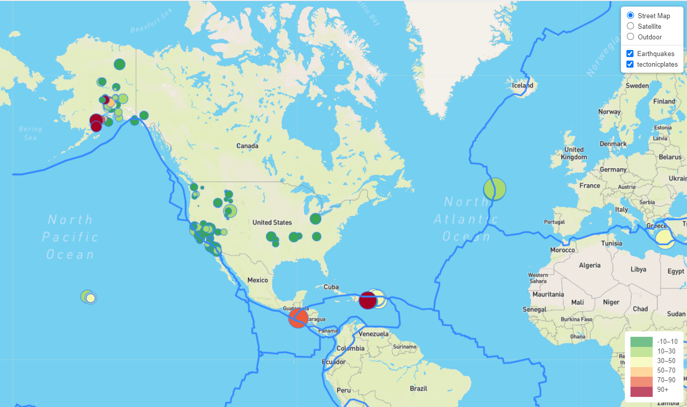

# Earthquakes-Leaflet

USGS United States Geological Survey
Welcome to the United States Geological Survey- USGS for short. To help understand data on natural hazards, healthy ecosystems and the impacts of climate, I have developed a useful tool to visualize earthquake data for the last 7 days. I have created an interactive map that displays locations of recent earthquakes around the world. The location points are sizes based on the earthquakes magnitude and the color reflects the depth of the event. There is also a helpful layer tool that adds tectonic plates to the map view to easily see the association of earthquake events in relation to plate location. Below is the final visualization: 

## Table of contents
* [Technologies](#technologies)
* [Build Map](#build-map)
* [Layers](#layers)
* [Status](#status)
* [Resources](#resources)
* [Contact](#contact)

## Technologies
* Leaflet 
* Mapbox
* D3
* Javascript
* HTML

## Build Map

To build my map, I used [Leaflet](https://leafletjs.com/) and [MapBox](https://docs.mapbox.com/). Within `javascript` , I used `d3.json` to read my data files from the USGS site. I selected coordinates and a zoom level to best display the earthquake data upon loading the web page. 

[map location](Images/myMap.PNG)

I then created baseman layers. Each layer has unique enhancements to the view that can help when evaluating the earthquake data. You can view the data in:

* ‘Street View’ – up close shows street other manmade factors
* ‘Satellite View’ – shows a live view of the earth
* ‘Outdoor’ – shows topographical details upon zooming in

[basemap](Images/basemaps.PNG)

## Layers 

## Features

## Status

## Resources

[Earthquake USGS](https://earthquake.usgs.gov/earthquakes/feed/v1.0/geojson.php)
[Earthquake Json](https://earthquake.usgs.gov/earthquakes/feed/v1.0/summary/all_day.geojson)

[Tectonic Plate Json](https://raw.githubusercontent.com/fraxen/tectonicplates/master/GeoJSON/PB2002_boundaries.json)

[Leaflet Documentation ](https://leafletjs.com/)

[MapBox Documentation ](https://docs.mapbox.com/)

## Contact

[Sara Simoes](https://github.com/Ssimoes48)
