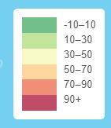

# Earthquakes-Leaflet

USGS United States Geological Survey
Welcome to the United States Geological Survey or USGS. To understand data on natural hazards, healthy ecosystems and the impacts of climate, I developed a useful tool to visualize earthquake data for the last 7 days. I created an interactive map that displays locations of recent earthquakes around the world. The location points are sizes based on the earthquake’s magnitude. The color reflects the depth of each event. There is also a helpful layer tool that adds tectonic plates to the map view to display the association of earthquake events in relation to plate location. Below is the final visualization: 

## Table of contents
* [Technologies](#technologies)
* [Build Map](#build-map)
* [Plot Points](#plot-points)
* [Legend](#legend)
* [Conclusion](#conclusion) 
* [Resources](#resources)
* [Contact](#contact)

## Technologies
* Leaflet 
* Mapbox
* D3
* Javascript
* HTML

## Build Map

To build my map, I used [Leaflet](https://leafletjs.com/) and [MapBox](https://docs.mapbox.com/). Within `javascript` , I used `d3.json` to read my data files from the USGS site. I selected coordinates and a zoom level to best display the earthquake data upon loading the web page. 

I then created baseman layers. Each layer adds unique enhancements to the view that assist when evaluating the earthquake data. You mayview the data in:

* ‘Street View’ – up close shows street other manmade factors

* ‘Satellite View’ – shows a live view of the earth

* ‘Outdoor’ – shows topographical details upon zooming in

Below is the code used to create these base map layers:

There is a second map layer that adds the Tectonic plate location to the map view. This is an interactive function and can be added or removed from view. 

## Plot Points 

To plot the earthquake data, I created a `function` that reads the `json` data and plots the longitude and latitude coordinates for each earthquake event. The location is marked with a circle. The size of the circle represents the magnitude of the event and the color represents the depth of the event.

When you click on the data points, there is a pop-up display that shows information about the earthquake event. 

Below is the code to create this pop-up feature:

## Legend

To create the legend which explains the color coding of the circle points, I assigned the value ranges and colors that correspond to the earthquake depth values. I then looped through the data with a `for loop` to assign each color. Below is the code: 

On the website, it appears as below: 

I also formatted the color codes to make the legend and data points with higher values for depth appear in red, and shallower events appear in green.

I used the `css` file to format the appearance of the legend on the webpage. 

## Conclusion

When you view this map visualization with the earthquake locations and the tectonic plate layer, there is a clear correlation between earthquake location and location of tectonic plates. 

 

## Resources

[Earthquake USGS](https://earthquake.usgs.gov/earthquakes/feed/v1.0/geojson.php)

[Earthquake Json](https://earthquake.usgs.gov/earthquakes/feed/v1.0/summary/all_day.geojson)

[Tectonic Plate Json](https://raw.githubusercontent.com/fraxen/tectonicplates/master/GeoJSON/PB2002_boundaries.json)

[Leaflet Documentation ](https://leafletjs.com/)

[MapBox Documentation ](https://docs.mapbox.com/)

## Contact

[Sara Simoes](https://github.com/Ssimoes48)
